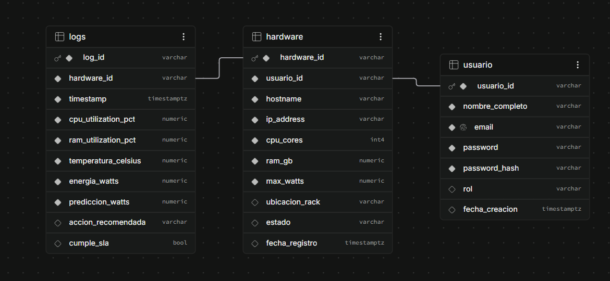

# Modelo de base de datos e integración

Referencia: diagrama y extracción del catálogo PostgreSQL aportados por el usuario el 2026-09-22. **Cerrada la verificación documental del esquema**: columnas, nulabilidad, defaults, PK/FK, UNIQUE, CHECK, índices y RLS contrastados con el resultado adjunto. No se ejecutaron cambios ni conexiones a la BD. La evidencia es una instantánea, no un volcado completo para restauración.

Evidencia normalizada: [esquema-verificado.json](assets/esquema-verificado.json).

## Columnas confirmadas

`—` significa que no hay default de columna. No hay columnas identity ni generadas en la extracción. Los identificadores son varchar(20), no UUID automáticos.

| Tabla | Columna | Tipo | Admite NULL | Default |
| --- | --- | --- | --- | --- |
| `hardware` | `hardware_id` | `varchar(20)` | No | — |
| `hardware` | `usuario_id` | `varchar(20)` | No | — |
| `hardware` | `hostname` | `varchar(100)` | No | — |
| `hardware` | `ip_address` | `varchar(45)` | No | — |
| `hardware` | `cpu_cores` | `integer` | No | — |
| `hardware` | `ram_gb` | `numeric(6,2)` | No | — |
| `hardware` | `max_watts` | `numeric(6,2)` | No | — |
| `hardware` | `ubicacion_rack` | `varchar(50)` | Sí | — |
| `hardware` | `estado` | `varchar(20)` | Sí | `'activo'::character varying` |
| `hardware` | `fecha_registro` | `timestamptz` | Sí | `now()` |
| `logs` | `log_id` | `varchar(20)` | No | — |
| `logs` | `hardware_id` | `varchar(20)` | No | — |
| `logs` | `timestamp` | `timestamptz` | No | — |
| `logs` | `cpu_utilization_pct` | `numeric(5,2)` | No | — |
| `logs` | `ram_utilization_pct` | `numeric(5,2)` | No | — |
| `logs` | `temperatura_celsius` | `numeric(5,2)` | No | — |
| `logs` | `energia_watts` | `numeric(6,2)` | No | — |
| `logs` | `prediccion_watts` | `numeric(6,2)` | No | — |
| `logs` | `accion_recomendada` | `varchar(100)` | Sí | — |
| `logs` | `cumple_sla` | `boolean` | Sí | `true` |
| `usuario` | `usuario_id` | `varchar(20)` | No | — |
| `usuario` | `nombre_completo` | `varchar(100)` | No | — |
| `usuario` | `email` | `varchar(150)` | No | — |
| `usuario` | `password` | `varchar(255)` | No | — |
| `usuario` | `password_hash` | `varchar(255)` | No | — |
| `usuario` | `rol` | `varchar(30)` | Sí | `'OPERADOR'::character varying` |
| `usuario` | `fecha_creacion` | `timestamptz` | Sí | `now()` |

## Restricciones confirmadas

Todas las restricciones devueltas están validadas.

| Tabla | Nombre | Definición |
| --- | --- | --- |
| `hardware` | `hardware_pkey` | `PRIMARY KEY (hardware_id)` |
| `hardware` | `hardware_usuario_id_fkey` | `FOREIGN KEY (usuario_id) REFERENCES usuario(usuario_id) ON DELETE CASCADE` |
| `logs` | `logs_hardware_id_fkey` | `FOREIGN KEY (hardware_id) REFERENCES hardware(hardware_id) ON DELETE CASCADE` |
| `logs` | `logs_pkey` | `PRIMARY KEY (log_id)` |
| `usuario` | `usuario_email_key` | `UNIQUE (email)` |
| `usuario` | `usuario_pkey` | `PRIMARY KEY (usuario_id)` |
| `usuario` | `usuario_rol_check` | `CHECK (upper(rol::text) = ANY (ARRAY['ADMINISTRADOR'::text, 'OPERADOR'::text, 'ADMIN'::text, 'OPERATOR'::text]))` |

Las FK son obligatorias: cada hardware referencia un usuario y cada log un hardware. Ambas tienen ON DELETE CASCADE: borrar un usuario elimina sus equipos y, en cascada, sus logs; borrar un equipo elimina sus logs. No se realizó ningún borrado.

El CHECK de rol compara `upper(rol)` con ADMINISTRADOR, OPERADOR, ADMIN y OPERATOR; no normaliza el valor almacenado y la columna permite NULL. La extracción no muestra CHECK de rango para CPU, RAM, porcentajes o potencia. NOT NULL no garantiza valores positivos ni porcentajes entre 0 y 100.

## Índices confirmados

- `CREATE UNIQUE INDEX hardware_pkey ON public.hardware USING btree (hardware_id)`
- `CREATE INDEX idx_logs_hardware_timestamp ON public.logs USING btree (hardware_id, "timestamp" DESC)`
- `CREATE INDEX idx_logs_timestamp ON public.logs USING btree ("timestamp" DESC)`
- `CREATE UNIQUE INDEX logs_pkey ON public.logs USING btree (log_id)`
- `CREATE UNIQUE INDEX usuario_email_key ON public.usuario USING btree (email)`
- `CREATE UNIQUE INDEX usuario_pkey ON public.usuario USING btree (usuario_id)`

## RLS y políticas confirmadas

Las tres tablas tienen RLS habilitada y no forzada. Cada una tiene una política PERMISSIVE, para ALL, dirigida al rol `public`, con USING (true) y sin WITH CHECK explícito: `Permitir todo en hardware`, `Permitir todo en logs` y `Permitir todo en usuario`. Estas políticas no restringen filas; los privilegios SQL efectivos dependen también de los GRANT y roles, que no forman parte de esta extracción. RLS habilitada no demuestra aislamiento por usuario ni permisos mínimos por servicio. No se modificaron políticas.

## Consecuencias para la integración

- `prediccion_watts`, `temperatura_celsius` y `energia_watts` son NOT NULL sin default. Una inserción ordinaria que las omita no queda satisfecha por un default; no rellenarlas con ceros ficticios. Los triggers no se inspeccionaron con esta consulta.
- `cumple_sla` admite NULL pero su default es true. Omitirlo puede registrar true sin una evaluación; ese valor por sí solo no acredita cumplimiento. Conservar NULL cuando no exista evaluación y se acuerde ese significado en el contrato de escritura.
- Los defaults `activo`, `OPERADOR` y `now()` no impiden NULL explícito en sus columnas.
- Los IDs tienen longitud máxima 20 y carecen de default. No truncar UUID ni usar automáticamente el run ID del Simulator como ID SQL.
- `password` y `password_hash` son ambos obligatorios, varchar(255), sin default. Se documenta el esquema existente; estos campos no pertenecen a inventarios, métricas ni contratos de Monitoring/Simulator.

## Límites de los servicios

- Monitoring consulta Prometheus y no lee ni escribe estas tablas. Su API v0.1 conserva su catálogo actual.
- Simulator utiliza inventarios JSON y registra ejecuciones en JSON/JSONL. Una fila SQL no es un inventario JSON válido del simulador. La lectura de `hardware` corresponde a un adaptador futuro, pendiente de implementación y permisos mínimos por servicio; no se implementa acceso a BD con este documento.
- Prometheus recolecta `/metrics` del Simulator; Monitoring consulta Prometheus. Configurar `monitoring.prometheus.instance-label=node` para conservar la identidad del equipo modelado.
- Las series del Simulator llevan `cluster=sim-run-<uuid>`, `node=<id del inventario>` y `origin=simulated`. No insertar resultados sintéticos en `logs` reales.
- Data Processing podrá consumir históricos autorizados de `logs`. La propiedad de escritura de predicciones, recomendaciones y SLA requiere un acuerdo adicional; su presencia en el esquema no autoriza escrituras desde Monitoring o Simulator.

## Correspondencia con Simulator

| Campo de hardware | Inventario actual / condición |
| --- | --- |
| `hardware_id` | Candidato a `nodes[].id` y etiqueta `node`. Debe cumplir `[A-Za-z0-9][A-Za-z0-9_.:-]{0,127}`; si no, acordar un mapeo estable y reversible, sin recortes ni colisiones. |
| `cpu_cores` | Candidato a `logical_cpus.value`, unidad `count`. Confirmar que cuenta CPU lógicas: núcleos físicos e hilos no son equivalentes. |
| `ram_gb` | Candidato a `memory.value`, entero en `bytes`. Confirmar GB decimal (`10^9`) o GiB (`2^30`) antes de convertir y acordar precisión; no asumir la base por el nombre. |
| `hostname`, `ip_address` | Metadatos, no sustituyen la identidad estable ni indican el endpoint del exporter. El JSON actual no admite estas claves. |
| `max_watts` | Capacidad declarada, no potencia instantánea; el motor actual no modela potencia. |
| `usuario_id`, `ubicacion_rack`, `estado`, `fecha_registro` | Sin campos equivalentes en el inventario actual; no agregarlos al JSON sin versionar el contrato. |

El inventario requiere también interfaces, filesystems y capacidades que no aparecen en `hardware`. No inventarlas como observaciones: usar fixtures o supuestos explícitos cuando corresponda. Cada capacidad tiene `value`, `unit` y `origin` (`synthetic_fixture`, `observed` o `modeling_assumption`). Leer hardware real no cambia el origen `simulated` de los resultados.

## Correspondencia con Monitoring e históricos

| Campo de logs | Interpretación y compatibilidad |
| --- | --- |
| `hardware_id` | Relación con hardware; asociar con `resourceId` solo mediante el mapeo de identidad acordado. No basta con igualar hostname o dirección del target. |
| `timestamp` | Instante con zona; normalizar a UTC. Prometheus usa tiempo de scrape; el tiempo lógico de una ejecución no es automáticamente un timestamp observado. |
| `cpu_utilization_pct` | Porcentaje; Monitoring `node.cpu.utilization` es ratio. Convertir porcentaje / 100 solo si coinciden denominador y ventana: Monitoring usa no-idle medio de CPU lógicas en 60 s. |
| `ram_utilization_pct` | Porcentaje; `node.memory.used` devuelve bytes (`MemTotal - MemAvailable`). No son intercambiables sin total de memoria del mismo instante y definición compatible del porcentaje. |
| `temperatura_celsius` | Temperatura; sin métrica equivalente en el catálogo v0.1 ni en el motor actual. |
| `energia_watts` | Por su unidad representa potencia en W, no energía. Se conserva el nombre SQL; fuente y método pendientes. No convertir directamente a Wh/kWh ni derivar desde CPU. |
| `prediccion_watts` | Potencia predicha, estimada; no es una medición ni una salida del Simulator actual. |
| `accion_recomendada`, `cumple_sla` | Resultado de decisión/evaluación; sin equivalente en Monitoring. Falta definir política y umbrales de SLA. |
| `log_id` | Identidad del registro SQL, distinta de run ID y de identidad de serie. |

Las métricas de red y filesystem de Monitoring no tienen columnas equivalentes en este diagrama. Tampoco existen columnas de origen, clúster o ejecución en `logs`: no asumir que el esquema permite mezclar y distinguir simulaciones. Los registros reales requieren documentar procedencia; `prediccion_watts` sigue siendo estimada aunque comparta fila con mediciones. Los campos obligatorios sin fuente no deben rellenarse con ceros o predicciones ficticias; respetar las restricciones confirmadas al diseñar la persistencia.

## Verificación y decisiones restantes

Se conserva la evidencia de 27 columnas, 7 restricciones, 6 índices, 3 estados RLS y 3 políticas. Se contrastaron las correspondencias con el catálogo de Monitoring y el inventario/exporter de Simulator. El pendiente de confirmar el esquema queda cerrado con la extracción aportada; no es una prueba de integración en ejecución ni una auditoría de GRANT o triggers.

Siguen siendo decisiones funcionales separadas: GB frente a GiB, CPU físicas frente a lógicas, procedencia de mediciones, política de evaluación de SLA y contratos de escritura de predicciones. El adaptador de inventario SQL sigue siendo futuro; conocer el esquema no lo implementa.
